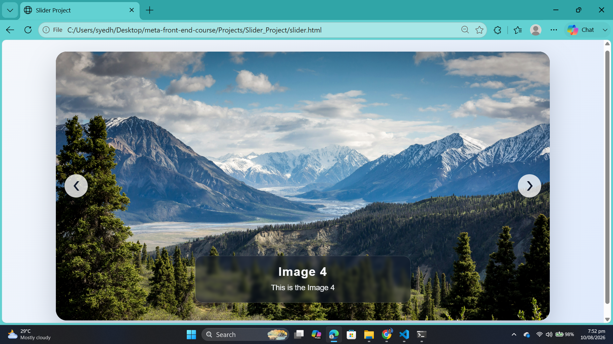

# Slider Project

## Project Preview



A simple JavaScript image slider built with HTML, CSS, and vanilla JavaScript.

## What it does

This project displays a series of images in a slideshow-style gallery. Users can:

- move to the next image with the right arrow button
- move to the previous image with the left arrow button
- view the current image title and description
- browse a set of landscape images in a clean, modern layout

## Project structure

- `slider.html` — page structure
- `styles.css` — styling and layout
- `slider.js` — image data and slider behavior
- `images/` — image assets used in the project

## How to run

1. Open the project folder in your browser.
2. Open `slider.html` directly in a browser, or run a local web server if preferred.

Example using Python:

```bash
python -m http.server
```

Then visit:

```text
http://localhost:8000
```

## Technologies used

- HTML
- CSS
- JavaScript

## GitHub ready

This project is lightweight and can be pushed to GitHub as a simple front-end project without any build setup.
